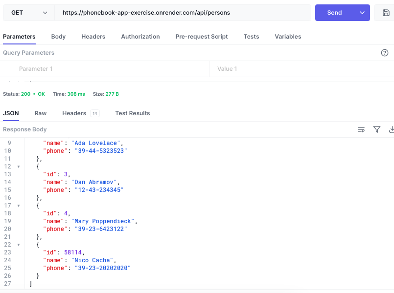

# phonebook-app

Deployment: render.com

[Online app link](https://phonebook-app-exercise.onrender.com/)

### Exercise 3.10 Phonebook backend

- [x] Render.com console
      

- [x] Test completed through Hoppscotch (open source altenative to Postman)
      
      

### Exercise 3.11 Phonebook backend

- [x] Production build of my frontend, and add it to Render.com Internet application.
      

- [x] Proxy added to frontend, still working locally (npm run dev).
      
      

## Extra stapes:

- [x] Streamline commands for deployment:
  ```
  "build:ui": "rm -rf dist && cd ../../part02/the-phonebook && npm run build && cp -r dist ../../part03/phonebook-exercise/",
  "deploy:full": "npm run build:ui && git add . && git commit -m uibuild && git push"
  ```
  
